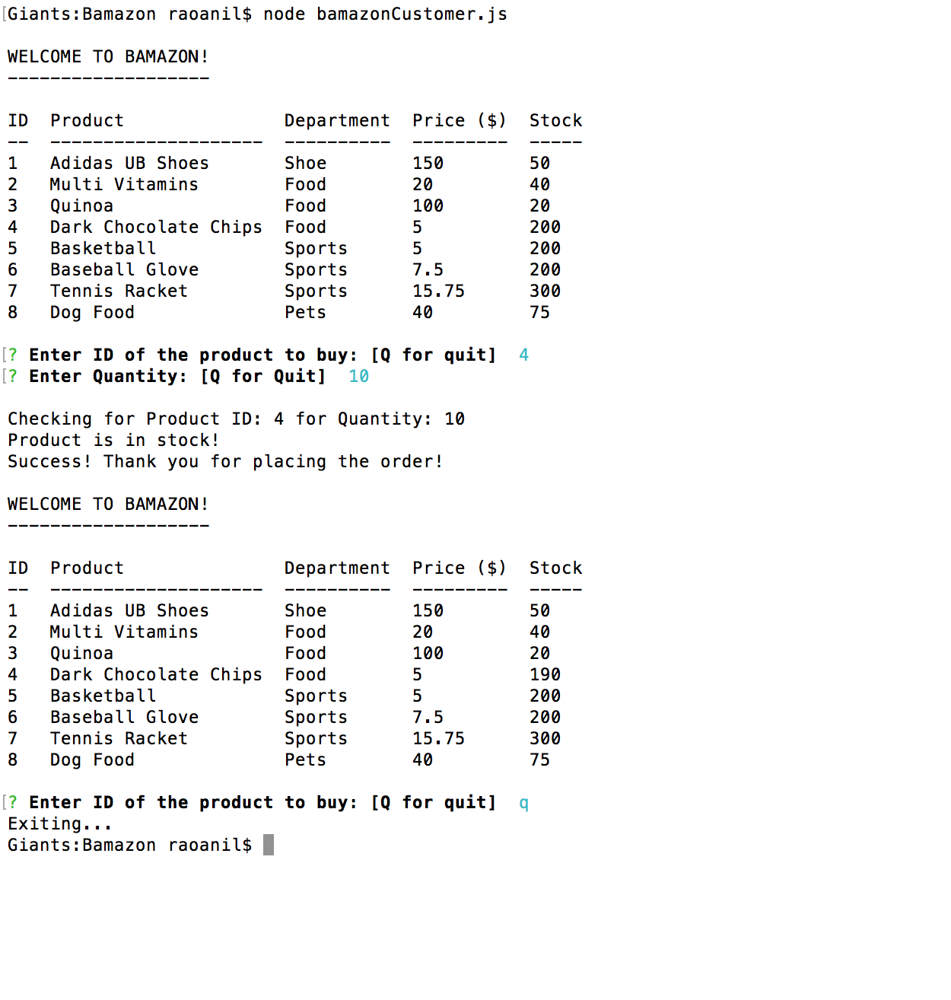
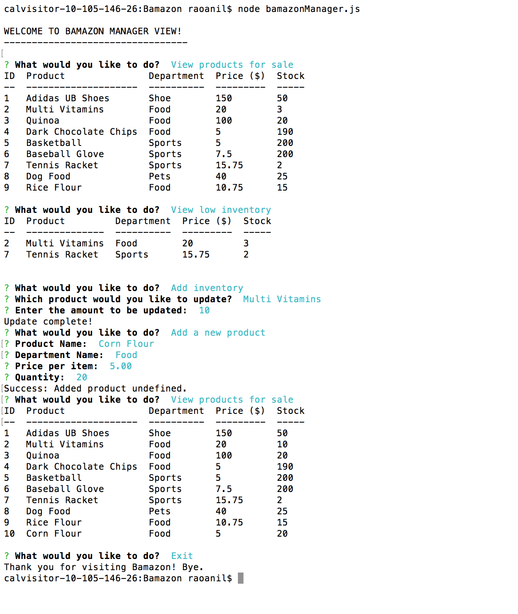
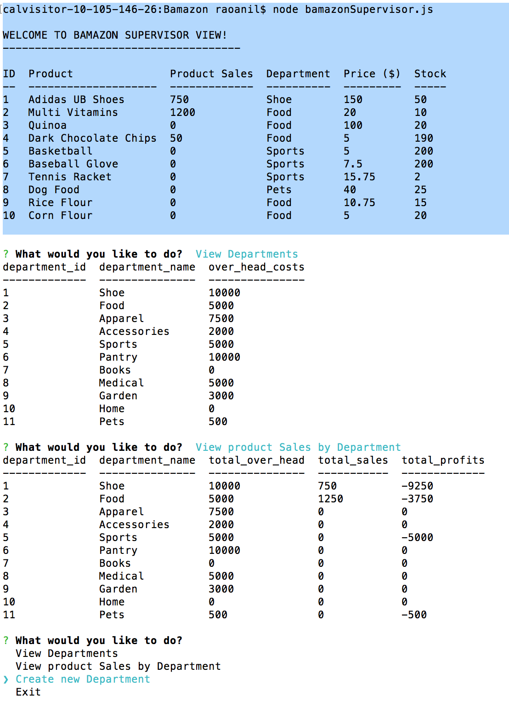
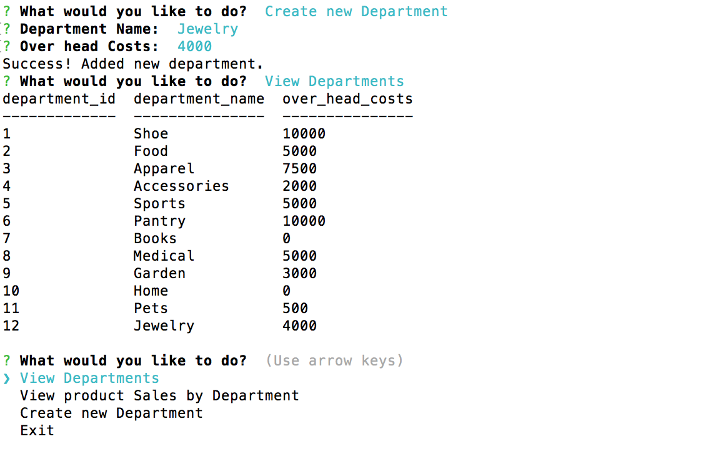

# Bamazon

Bamazon app has three view:  Customer, Manager and Supervisor.  Following is a brief description of the functions of each view:

Customer: 
* Run by giving this command in the terminal: 'node bamazonCustomer.js'
* This will first display all products available for sale.
* The app then prompts users with two messages.
    * The first asks the users the ID of the product they would like to buy.[Q for quit]
    * The second message asks how many units of the product they would like to buy.[Q for quit]
* Once the customer has placed the order, the application checks if the store has enough of the product to meet the customer's request and either complete the sale or display appropriate message accordingly.

Manager:
* Run by giving this command in the terminal: 'node bamazonManager.js'
* List a set of menu options:
    * View Products for Sale
    * View Low Inventory
    * Add to Inventory
    * Add New Product
    * Exit
* If a manager selects View Products for Sale, the app lists every available item: the item IDs, names, prices, and quantities.
* If a manager selects View Low Inventory, then it lists all items with an inventory count lower than five.
* If a manager selects Add to Inventory, your app displays a prompt that will let the manager "add more" of any item currently in the store.
* If a manager selects Add New Product, it should allow the manager to add a completely new product to the store.

Supervisor:
* Run by giving this command in the terminal: 'node bamazonManager.js'
* List a set of menu options:
    * View Product Sales by Department [Q for quit]
    * Create New Department [Q for quit]

Screenshots:

## Customer View

## Manager View

## Supervisor View

    
